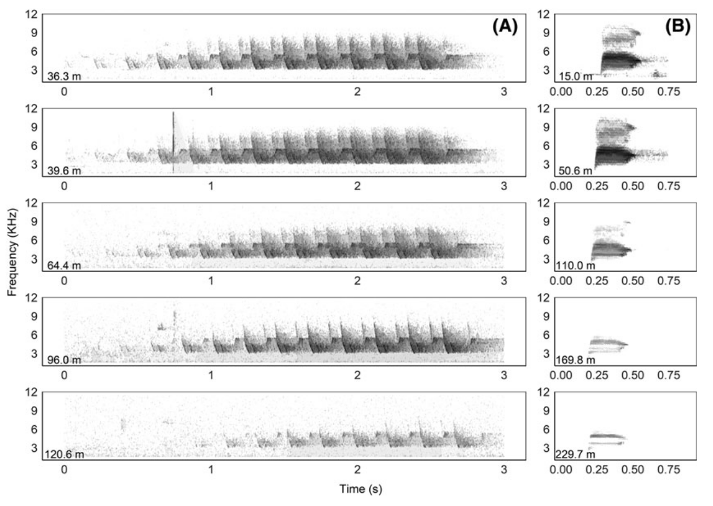
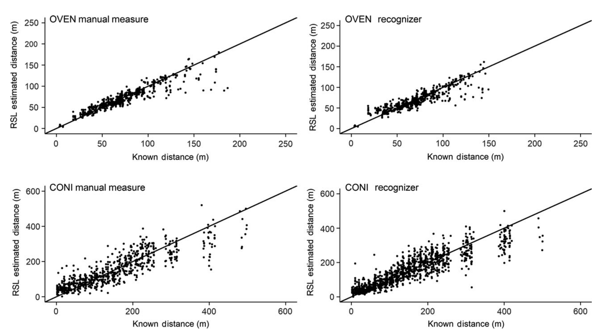

```{r setup,include=FALSE}
options(width=53, scipen=999)
library(knitr)
```

# Checking in

1. ~~Introduction~~
2. ~~Organizing and processing point count data~~
3. ~~A primer in regression techniques~~

Short break

4. ~~Behavioral complexities~~
5. ~~The detection process~~

Lunch break

6. Dealing with recordings
7. A closer look at assumptions

Short break

8. Understanding roadside surveys
9. Miscellaneous topics

Dismissal

***

# Recordings for acoustic surveys

Non-autonomous recording equipment have been used to 

- 'back up' field surveys (permanent record),
- to be able to get 2nd opinion (reviewed by multiple observers),
- or to be listened to and ID-ed in the lab, ability to listen multiple times.

Can be done by both trained and non-trained observers.

***

# Automated recording units (ARUs)

More increasingly, ARUs are used:

- minimum of two visits by field personnel,
- can be programmed (when and for how long),
- run over several months (battery, storage),
- no observer avoidance bias,
- to survey hard to access areas (on winter roads).

***

# Disadvantages

- Loss of data could go unnoticed for a longtime,
- temporal vs. spatial coverage trade-off,
- costs can be high (there is a wide range): purchase + maintenance (batteries, microphones, SD cards),

***

# Recordings


\centering
```{r echo=FALSE,out.width="300px"}
include_graphics("../images/sonogram.png")
```

Sonogram from [WindTrax](http://www.wildtrax.ca/): an ARU/camera data platform.

***

# Sonograms

There are many ways the same recording can be transcribed:

- detection/non-detection,
- time to 1st detection in each 1-min interval (no individuals tracked),
- removal sampling in 3 or 10 minutes duration,
- full detection history by 1-min intervals,
- all detections.

***

# Integrating human PC & ARUs

It requires careful consideration of these aspects of sampling:

1. 'Transcription' level details: measure the same variables (make as human PC-like as possible),
2. human PC--ARU detectability differences: need to be understood and accounted for,
3. survey design domain: dates and times sampled need to coincide or overlap.

***

# Transcription

Make sure that ARU based counts have similar meaning to human point counts.

Usually this means shorter duration, it gets harder to track individuals with stereo headphones over 3 mins in busy recordings.

***

# Sub-intervals

**Time intervals**: both ARUs and human PCs can have multiple time intervals --- recordings can arbitrarily stratified and re-listened.

**DIstance intervals**: humans in the field can assign birds to distance bands, ARU based assignment becomes difficult (relative distance, needs calibration) --- ARU based counts are like $0-\infty$ m unlimited distance counts.

***

# Sound pressure level vs. EDR

\centering
```{r echo=FALSE,out.width="300px"}
include_graphics("../images/yip-2017-ace-fig-3.png")
```

Yip et al. 2017, [ACE](http://dx.doi.org/10.5751/ACE-00997-120111).

***

# Distance effects on ARU data

\centering
```{r echo=FALSE,out.width="250px"}

```

Sonogram images are different[^1].

[^1]: Yip et al. 2019, [RSEC](http://dx.doi.org/10.1002/rse2.118).

***

# Distance estimation based on ARU data

\centering
```{r echo=FALSE,out.width="300px"}

```

Use known distances to calibrate relationship[^2].

[^2]: Yip et al. 2019, [RSEC](http://dx.doi.org/10.1002/rse2.118).

***

# What is a recognizer?

Recognizer is a computational classifier that is trained on a set of data and then applied to classify independent data sets.

Often based on elliptical Fourier transformation or image recognition algorithms (deep learning, natural nets).

The recognizer gives a probabilistic output (reliability score) for each detection.

***

# Human PC--ARU detectability differences

\centering
```{r echo=FALSE,out.width="150px"}
include_graphics("../images/yip-2017-ace-fig-1.png")
```

ARUs are like different observers[^2].

***

# Human PC--ARU detectability differences

\centering
```{r echo=FALSE,out.width="150px"}
include_graphics("../images/yip-2017-ace-fig-2.png")
```

Different sensitivity leads to different EDR (A) and MDD (B).

***

# Survey domain

Human PC usually happens in late May early June, between 2 to 8 am --- ARUs can record any time.

If dates and times are different, it can make surveys and recordings in comparable:

- How do you compare a dawn PC to midnight recording? (availability is different)
- How do you compare a March recording to a June PC for a migratory species? (true status is different)

