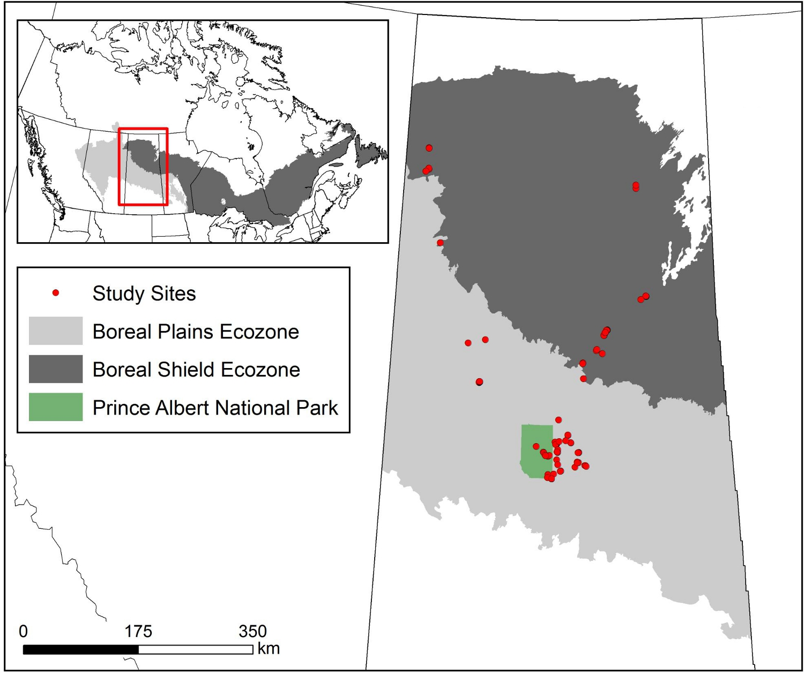
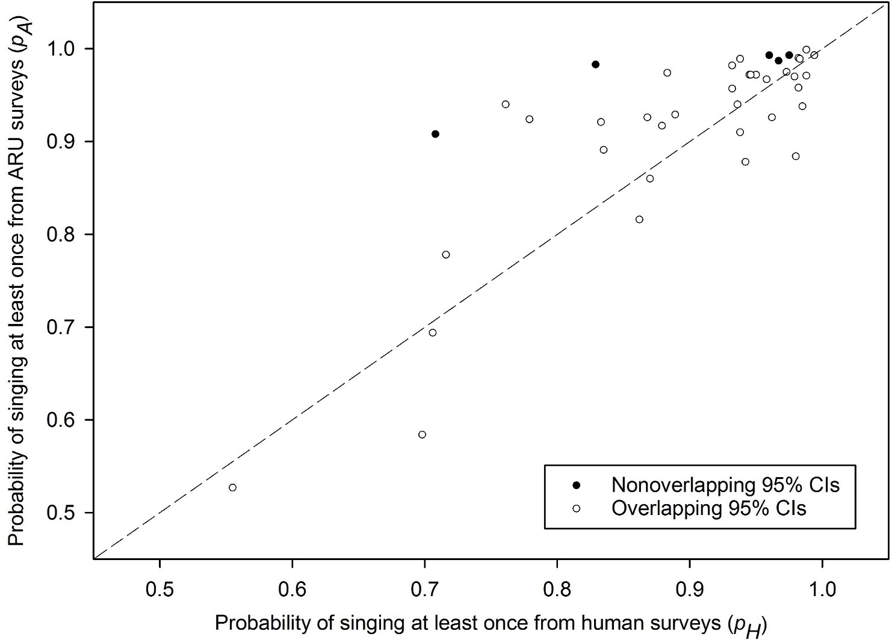
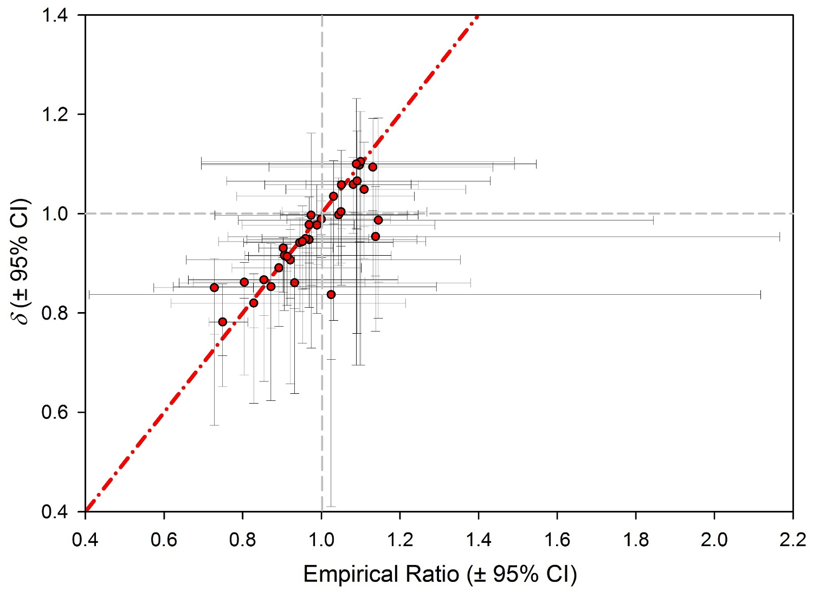
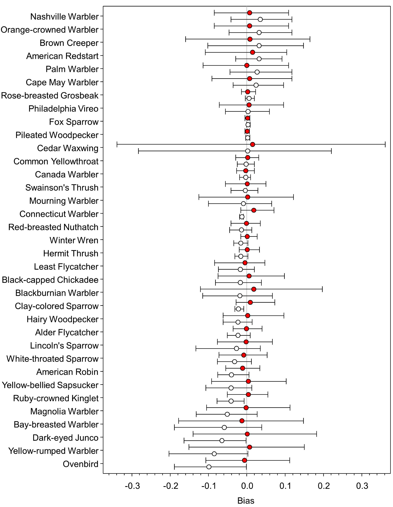

```{r setup,include=FALSE}
options(width=53, scipen=999)
library(knitr)
```

# Checking in

1. ~~Introduction~~
2. ~~Organizing and processing point count data~~
3. ~~A primer in regression techniques~~

Short break

4. ~~Behavioral complexities~~
5. ~~The detection process~~

Lunch break

6. Dealing with recordings
7. A closer look at assumptions

Short break

8. Understanding roadside surveys
9. Miscellaneous topics

Dismissal

***

# Recordings for acoustic surveys

Non-autonomous recording equipment have been used to 

- 'back up' field surveys (permanent record),
- to be able to get 2nd opinion (reviewed by multiple observers),
- or to be listened to and ID-ed in the lab, ability to listen multiple times.

Can be done by both trained and non-trained observers.

***

# Automated recording units (ARUs)

More increasingly, ARUs are used:

- minimum of two visits by field personnel,
- can be programmed (when and for how long),
- run over several months (battery, storage),
- no observer avoidance bias,
- to survey hard to access areas (on winter roads).

***

# Disadvantages

- Loss of data could go unnoticed for a longtime,
- temporal vs. spatial coverage trade-off,
- costs can be high (there is a wide range): purchase + maintenance (batteries, microphones, SD cards),

***

# Recordings


\centering
```{r echo=FALSE,out.width="300px"}
include_graphics("../images/sonogram.png")
```

Sonogram from [WindTrax](http://www.wildtrax.ca/): an ARU/camera data platform.

***

# Sonograms

There are many ways the same recording can be transcribed:

- detection/non-detection,
- time to 1st detection in each 1-min interval (no individuals tracked),
- removal sampling in 3 or 10 minutes duration,
- full detection history by 1-min intervals,
- all detections.

***

# Integrating human PC & ARUs

It requires careful consideration of these aspects of sampling:

1. 'Transcription' level details: measure the same variables (make as human PC-like as possible),
2. human PC--ARU detectability differences: need to be understood and accounted for,
3. avoid extrapolation: dates and times sampled need to coincide or overlap,
4. check transferability: sometimes interpolation won't even work.

***

# Transcription

Make sure that ARU based counts have similar meaning to human point counts.

Usually this means shorter duration, it gets harder to track individuals with stereo headphones over 3 mins in busy recordings.

***

# Sub-intervals

**Time intervals**: both ARUs and human PCs can have multiple time intervals --- recordings can arbitrarily stratified and re-listened.

**DIstance intervals**: humans in the field can assign birds to distance bands, ARU based assignment becomes difficult (relative distance, needs calibration) --- ARU based counts are like $0-\infty$ m unlimited distance counts.

***

# Sound pressure level vs. EDR

\centering
```{r echo=FALSE,out.width="300px"}
include_graphics("../images/yip-2017-ace-fig-3.png")
```

Yip et al. 2017, [ACE](http://dx.doi.org/10.5751/ACE-00997-120111).

***

# Distance effects on ARU data

\centering
```{r echo=FALSE,out.width="250px"}
include_graphics("../images/yip-2019-fig-1.png")
```

Sonogram images are different[^1].

[^1]: Yip et al. 2019, [RSEC](http://dx.doi.org/10.1002/rse2.118).

***

# Distance estimation based on ARU data

\centering
```{r echo=FALSE,out.width="300px"}
include_graphics("../images/yip-2019-fig-4.png")
```

Use known distances to calibrate relationship[^2].

[^2]: Yip et al. 2019, [RSEC](http://dx.doi.org/10.1002/rse2.118).

***

# What is a recognizer?

Recognizer is a computational classifier that is trained on a set of data and then applied to classify independent data sets.

Often based on elliptical Fourier transformation or image recognition algorithms (deep learning, natural nets).

The recognizer gives a probabilistic output (reliability score) for each detection.

***

# Human PC--ARU detectability differences

\centering
```{r echo=FALSE,out.width="150px"}
include_graphics("../images/yip-2017-ace-fig-1.png")
```

ARUs are like different observers[^2].

***

# Human PC--ARU detectability differences

\centering
```{r echo=FALSE,out.width="150px"}
include_graphics("../images/yip-2017-ace-fig-2.png")
```

Different sensitivity leads to different EDR (A) and MDD (B).

***

# Issues with extrapolation

Human PC usually happens in late May early June, between 2 to 8 am --- ARUs can record any time.

If dates and times are different, it can make surveys and recordings in comparable:

- How do you compare a dawn PC to midnight recording? (availability is different)
- How do you compare a March recording to a June PC for a migratory species? (true status is different)

***

# Model transferability

Even though we have same dates and times in training data, models are not necessarily transferable to other regions. E.g. Northwest Territories 
ARU surveys:

- white nights in the breeding season, meaning of midnight and sunrise is different from southern Boreal (need to build local availability models),
- migration to the north takes longer, phenology is shifted (use time since 1st day of spring or from NDVI based year specific green-up).
- lots of large burns and arctic tundra: larger than usual EDRs (this requires calibration).

***

# How do we do this?

1. Calibration based on **playback experiments** (pure tones, recorded songs): true state is _known_, differences are assessed against this know truth,
2. Calibration based on **paired sampling** (human PC recorded and transcribed): true state is _unknown but identical_,
3. Model based approach (ARU type as a fixed effect): true state is neither known nor identical, this works for larger samples given reasonable interspersion (i.e. avoid using this approach when human PC is in uplands, ARUs are in lowland habitats).

***

# Calibration based on playbacks

- True state is fixed ($N=1$),
- event times ($t$) are known (we push the button on the player),
- distances along the transect are known ($d$),
- only the detection process outcome varies ($Y$).

***

# Adjustments

We can fit logistic regression to estimate the form of the distance function, because we have non-detections too (it is only 1D: no need for integral).

We can estimate unlimited distance EDR for any device (although this is relative because sound pressures might not be realistic).

We can use human listener performance from the field, we can come up with adjustments for effective area sampled as: $EDR_R=\Delta EDR_H$.

***

# Recall: distance sampling

We linearized the Half-Normal relationship
by taking the log of the distance function: 

$$log(g(d)) =log(e^{-(d/\tau)^2})= -(d / \tau)^2 = x \frac{1}{\tau^2} = 0 + x \beta$$
Than we used GLM to fit a model:

- with $x = -d^2$ as predictor
- without intercept, 
- estimated $\hat{\beta}$
- calculate EDR as $\hat{\tau}=\sqrt{1/\hat{\beta}}$.

***

# Paired sample data set

\centering
```{r echo=FALSE,out.width="200px"}

```

Van Wilgenburg et al. 2017 [ACE](https://doi.org/10.5751/ACE-00975-120113).

***

# The logic

$$\frac{E[Y_R]}{E[Y_H]} = \frac{D (EDR_R^2)p}{D (EDR_H^2)p}=\Delta^2$$

$D$ constant: fixed by design (same place, same time),

$p$ is assumed to be constant (observer is present at the time of recording).

The only thing that is driving the difference in counts is EDR.

***

# Testing availability

\centering
```{r echo=FALSE,out.width="200px"}

```

Availability was found to be not too variable (driven by count differences after detection differences).

***

# Empirical vs. model based $\Delta$

\centering
```{r echo=FALSE,out.width="200px"}

```

$\sum Y_R / \sum Y_H = \hat{\Delta}^2$ under paired sampling

***

# Paired sample data set

\centering
```{r echo=FALSE,out.width="150px"}

```

Using $\hat{\Delta}^2$ as adjustment really helps in integrating human PC and ARU data sets.

***

# Get our hands dirty

```{r eval=FALSE}
library(paired)
str(paired)
```
