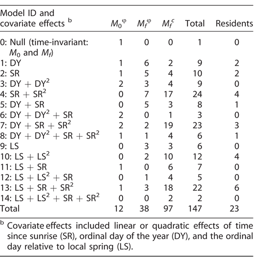

```{r setup,include=FALSE}
options(width=53, scipen=999)
library(knitr)
```

# Checking in

1. ~~Introduction~~
2. ~~Organizing and processing point count data~~
3. ~~A primer in regression techniques~~

Short break

4. ~~Behavioral complexities~~
5. The detection process

Luch break

6. Dealing with recordings
7. A closer look at assumptions

Short break

8. Understanding roadside surveys
9. Miscellaneous topics

Dismissal

***

# What is detectability?

In the most colloquial terms, $\delta$ is the probability
that a species is detected given it is present:

$$P(Y>0 \mid N>0)$$

***

# Occupancy

In an occupancy framework, we can have:

1. A detection ($Y>0$), $P(Y>0 \mid N>0)=\delta \varphi$,
2. A nondetection ($Y=0$), $P(Y=0 \mid N>0)=(1-\delta) \varphi$,
3. An absence ($Y=0$), $P(Y=0 \mid N=0)=1-\varphi$.

$\delta$ is the _false negative rate (FNR)_.

***

# Abundance

A lot more combinations of true abundance and observed counts:

|   | $Y$ = 0  |  1 | 2  |  ... |
|---|---|---|---|---|
|  $N$ = 0 | x  |   |   |   |
|  1 |  x | x  |   |   |
| 2  |  x | x  |  x |   |
| ...  | x  | x  | x  | x  |

***

# Estimating detectability

To estimate $\delta$, we need:

- ancillary information (multiple visits, distance bands, time intervals, observers),
- parametric model assumptions (i.e. $\delta$ varies across locations).

***

# The myth of constant detectability

Detectability zealots often view a method that cannot estimate
constant detection probability $\delta$ 
(e.g. single-visit occupancy and N-mixture models) as inferior.

Fortunately for the rest of us: $\delta$ can only be constant
in very narrow situations, e.g. when suveys are conducted:

- in the same region,
- in similar habitat,
- in the same year,
- on the same day,
- at the same time,
- by the same observer,
- using the same protocol.

***

# Constant detectability is rare

Often a consequence of small sample size (i.e.
not a lot of detection for a species)[^1][^2]:

\centering
```{r echo=FALSE,out.width="200px",fig.show = 'hold',out.width='50%'}
include_graphics("../images/qpad_tab1.png")

```

[^1]: Solymos et al. 2013, [Methods. Ecol. Evol. 4:1047--1058](http://dx.doi.org/10.1111/2041-210X.12106).
[^2]: Solymos et al. 2018, [Condor 120:765--786](http://dx.doi.org/10.1650/CONDOR-18-32.1).

***

# Let's unwrap p

1. Once the species/individual is present ($N>0$),
2. it needs to make itself heard/visible, make itself available ($p$) -- we have just discussed this,
3. then it needs to be detected by an observer (either in the field or in the lab listening to a recording) -- let's call this probability $q$.

These imply a set total time duration and maximum counting radius.

***

# QPAD

Now we can expand our equation:
$E[Y]=NC=(AD)(pq)=qpAD$

The expected value of the observed count becomes a function of the:

- population density ($D$),
- area sampled ($A$),
- availability ($p$),
- and perceptibility ($q$).

***

# Space and time to the rescue

\centering
```{r echo=FALSE,out.width="190px"}
include_graphics("../images/qpad_fig2.png")
```

$p$ is a monotonic function of _time_, while $q$ is monoting function of _area_ (space).

***

# Availability varies

\centering
```{r echo=FALSE,out.width="300px"}
include_graphics("../images/qpad_fig3.png")
```

***

# Availability really varies

\centering
```{r echo=FALSE,out.width="200px"}
include_graphics("../images/solymos-2018-condor-fig-5.png")
```

***

# Biologyical machanisms

- Migration timing drives phenology for many species, e.g. ordinal day of year (`DAY`),
- when study spans across biomes, use time since local spring (multi-year average),
- or time since spring green up, last snow day, etc. based on actual survey year,
- time of day,
- time since local sunrise (`TSSR`).

***

# Perceptibility varies too

\centering
```{r echo=FALSE,out.width="300px"}
include_graphics("../images/qpad_fig4.png")
```

***

# Estimating nuisance variables

We have discussed how to estimate $p$.

Next we will discuss how to estimate $q$ based on distance sampling.

***

# TODO

Summarize removal sampling from chapter

Summarize distance sampling from chapter


***

# Corrections

\centering
```{r echo=FALSE,out.width="300px"}
include_graphics("../images/qpad_fig5.png")
```

***

# OVEN

\centering
```{r echo=FALSE,out.width="300px"}
include_graphics("../images/qpad_fig6.png")
```

