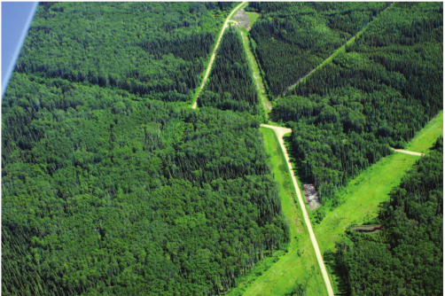
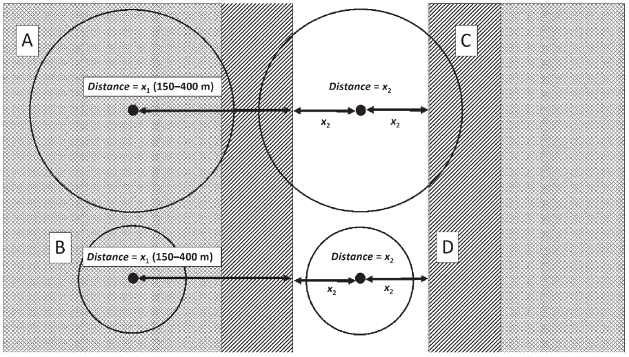
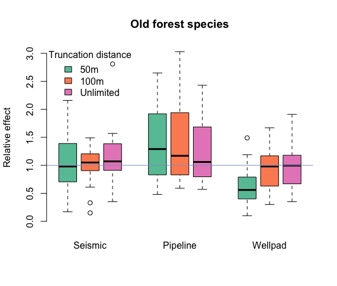
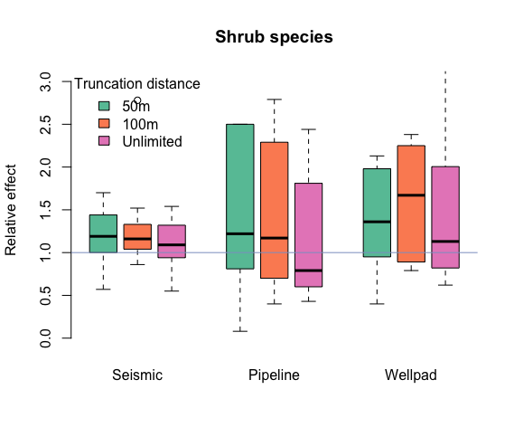
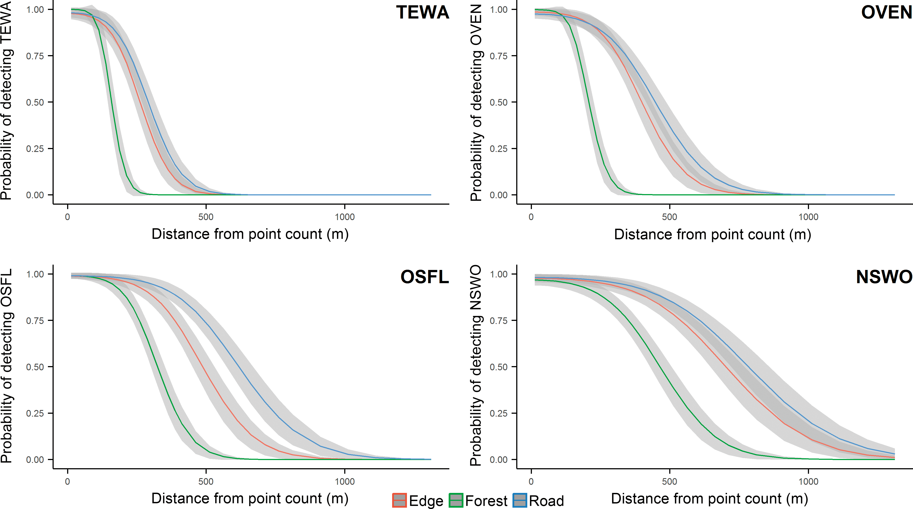
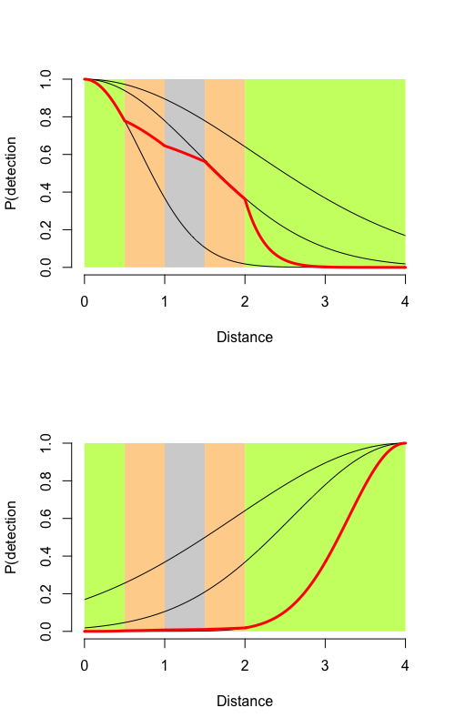

```{r setup,include=FALSE}
options(width=53, scipen=999)
library(knitr)
```

# Checking in

1. ~~Introduction~~
2. ~~Organizing and processing point count data~~
3. ~~A primer in regression techniques~~

Short break

4. ~~Behavioral complexities~~
5. ~~The detection process~~

Lunch break

6. ~~Dealing with recordings~~
7. ~~A closer look at assumptions~~

Short break

8. Understanding roadside surveys
9. Miscellaneous topics

Dismissal

***

# Roadside bias

Roadside bias captures the different between a roadside survey count ($E[Y_R]$)
and a count done in a similar off-road envoronment ($E[Y_H]$).

Large variation across species:

- forest associated species show negative roadside bias ($E[Y_R] < E[Y_H]$),
- generalist and open-field species show positive roadside bias ($E[Y_R] > E[Y_H]$).

The bias is predominantly negative in the forests.

***

# Mechanisms of roadside bias

1. Numeric response: $D_R \neq D_H$, e.g. birds usually don't nest on pavement,
2. behavioral response: $\phi_R \neq \phi_H$, increased/decreased singing activity along roads,
3. detectability differences: $\hat{A}_R \neq \hat{A}_H$ roads create an opening in forests thus increasing effective sampling area.

These are well known, but attribution (their relative importance) is quite difficult.

Also there are different kinds of roads (highways vs. unpaved trails), which might pose different mix of these mechanisms.

***

# Problem with small features

\centering
```{r echo=FALSE,out.width="250px"}

```

Bayne et al. 2016, [Condor](http://www.bioone.org/doi/10.1650/CONDOR-15-126.1).

***

# Survey design

\centering
```{r echo=FALSE,out.width="250px"}

```

***

# Results

\centering
```{r echo=FALSE,out.width="250px"}

```

Bayne et al. 2016, [Condor](http://www.bioone.org/doi/10.1650/CONDOR-15-126.1).

***

# Results

\centering
```{r echo=FALSE,out.width="250px"}

```

See `_data/bayne-2016/condor.R`.

***

# Stratified sampling

```{r echo=FALSE,fig.width=9,fig.height=7}
op <- par(mfrow=c(2,2))

set.seed(1)
n <- 100
x <- sort(runif(n, 0, 1))
Da <- 2
Db <- 6
lam <- x*Da + (1-x)*Db
y <- rpois(n, lam)
m <- glm(y ~ x, family=poisson)

plot(y ~ x, col="grey", ylim=c(0,12))
abline(h=c(Da, Db), lty=2)
rug(x, col=2)
lines(fitted(m) ~ x, col=2)
lines(c(0, 1), c(Db, Da), col=4)
legend("topright", bty="n", lty=1, col=c(4,2),
  legend=c("True", "Estimated"))

set.seed(1)
n <- 100
x <- sort(runif(n, 0, 1))
Db <- 2
Da <- 6
lam <- x*Da + (1-x)*Db
y <- rpois(n, lam)
m <- glm(y ~ x, family=poisson)

plot(y ~ x, col="grey", ylim=c(0,12))
abline(h=c(Da, Db), lty=2)
rug(x, col=2)
lines(fitted(m) ~ x, col=2)
lines(c(0, 1), c(Db, Da), col=4)

set.seed(1)
Da <- 2
Db <- 6
x <- sort(runif(n, 0, 0.2))
lam <- x*Da + (1-x)*Db
y <- rpois(n, lam)
m <- glm(y ~ x, family=poisson)
pr <- predict(m, type="response",
  newdata=data.frame(x=seq(0,1,0.01)))
plot(y ~ x, col="grey", xlim=c(0, 1), ylim=c(0,12))
abline(h=c(Da, Db), lty=2)
rug(x, col=2)
lines(pr ~ seq(0,1,0.01), col=2)
lines(c(0, 1), c(Db, Da), col=4)

set.seed(1)
Da <- 6
Db <- 2
x <- sort(runif(n, 0, 0.2))
lam <- x*Da + (1-x)*Db
y <- rpois(n, lam)
m <- glm(y ~ x, family=poisson)
pr <- predict(m, type="response",
  newdata=data.frame(x=seq(0,1,0.01)))
plot(y ~ x, col="grey", xlim=c(0, 1), ylim=c(0,12))
abline(h=c(Da, Db), lty=2)
rug(x, col=2)
lines(pr ~ seq(0,1,0.01), col=2)
lines(c(0, 1), c(Db, Da), col=4)

par(op)
```

***

# Behavior

It is like a mixture model where mixing probabilities
depend on the area of the strata.

Think of it as each group is made up of individuals living in the 
different strata (happen to be there for the duration of the survey),
acting in a certain way (sing more/less along the edges, 
not at all on the roads, etc.).

Problem is: due to the detection process, this really means
effective area, which involves a lot of integrals.

***

# Distance effects: design

\centering
```{r echo=FALSE,out.width="250px"}
include_graphics("../images/yip-2017-condor-fig-1.png")
```

Yip et al. 2017, [Condor](http://dx.doi.org/10.1650/CONDOR-16-93.1).

***

# Distance effects: results

\centering
```{r echo=FALSE,out.width="250px"}

```

Yip et al. 2017, [Condor](http://dx.doi.org/10.1650/CONDOR-16-93.1).

***

# Sound attenuation: direction matters


\centering
```{r echo=FALSE,out.width="180px"}

```

***

# Accounting for roadside bias

- Calibration: not very common, many kinds of habitat/road types, 
- joint modeling: difficult to estimate due to the complexities,
- fixed effects: possibly with interactions with land cover,
- design based approach: filter worst offenders.

I usually combine some filtering with fixed effects.


