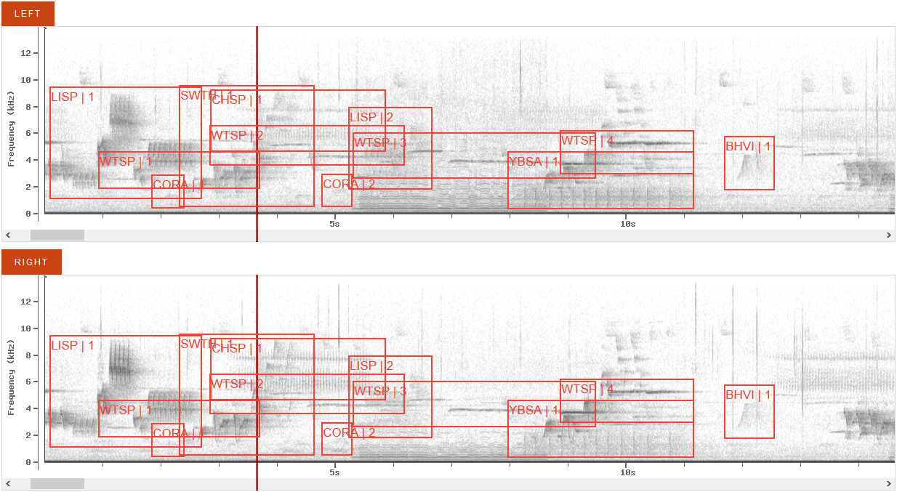

```{r setup,include=FALSE}
options(width=53, scipen=999)
library(knitr)
```

# What is a point count?

- A trained observer 
- records all the birds 
- seen and heard 
- from a point count station 
- for a set period of time
- within a defined distance radius.

***

# Questions we want to answer using point counts

- How many? (Abundance, density, population size)
- Is this location part of the range? (0/1)
- How is abundance changing in space? (Distribution)
- How is abundance changing in time? (Trend)
- What is the effect of a treatment on abundance?

***

# Sample and replication

- We want to make inferences about a population,
- full census is out of reach,
- thus we take a sample of the population
- that is representative and random.
- Ideally, sample size should be as large as possible,
- it reduces variability and 
- increases statistical power.

***

# How do we pick where to survey?

- Stratification,
- gradients,
- random location to control for unmeasured effects,
- take into account historical surveys (avoid, or revisit),
- accessibility/cost (clusters).

***

```{r test,echo=FALSE,out.width="300px"}

```

